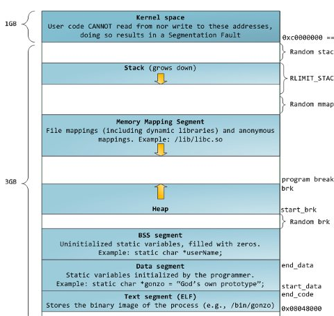

# malloc
OS: linux



## sbrk_test1.cpp

```
➜  malloc git:(master) ✗ ./sbrk_test1
end of bss section:0x601070
pmem:0x1ef8010
1-gap between heap and bss:26177440
pmem:0x1ef8010
2-gap between heap and bss:26177440
➜  malloc git:(master) ✗ ./sbrk_test1
end of bss section:0x601070
pmem:0x7de010
1-gap between heap and bss:1953696
pmem:0x7de010
2-gap between heap and bss:1953696
➜  malloc git:(master) ✗ ./sbrk_test1
end of bss section:0x601070
pmem:0x1eb1010
1-gap between heap and bss:25886624
pmem:0x1eb1010
2-gap between heap and bss:25886624

```

从上面的输出中，可以发现几点：
1. bss 段一旦在在程序编译好后，它的地址就已经规定下来。
2. 一般及简单的情况下，使用 malloc() 申请的内存，释放后，仍然归还回原处，再次申请同样大小的内存区时，还是从第 1 次那里获得。
3. bss segment 结束处和堆的开始处的空隙大小，并不因为 sbrk() 的调整而改变，也就是说明了 program break 不是调整堆头部。

## sbrk_test2.cpp

```
➜  malloc git:(master) ✗ ./sbrk_test2
pmem:0x230f010
heap size on each load: 135152
➜  malloc git:(master) ✗ ./sbrk_test2
pmem:0x8b6010
heap size on each load: 135152
➜  malloc git:(master) ✗ ./sbrk_test2
pmem:0x2036010
heap size on each load: 135152
```
从输出可以看到，虽然堆的头部地址在每次程序加载后都不一样，但是每次加载后，堆的大小默认分配是一致的。但是这不是不能改的，可以使用 sysctl 命令修改一下内核参数

## sbrk_test3.cpp

```
➜  malloc git:(master) ✗ ./sbrk_test3
pmem:0xc0e010
1
2
3
4
5
...
➜  malloc git:(master) ✗ ./sbrk_test3
pmem:0x23cd010
1
2
3
4
5
...
```
从输出看到，sbrk(1) 每次让堆往栈的方向增加 1 个字节的大小空间。
而 brk() 这个函数的参数是一个地址，假如你已经知道了堆的起始地址，还有堆的大小，那么你就可以据此修改 brk() 中的地址参数已达到调整堆的目的。

实际上，在应用程序中，基本不直接使用这两个函数，取而代之的是`malloc()`一类函数，这一类库函数的执行效率会更高。还需要注意一点，当使用 `malloc()`分配过大的空间，比如超出 0x20ff0 这个常数(在我的系统(Fedora15)上是这样，别的系统可能会有变)时，`malloc`不再从堆中分配空间，而是使用`mmap()`这个系统调用从映射区寻找可用的内存空间。

https://blog.csdn.net/sgbfblog/article/details/7772153